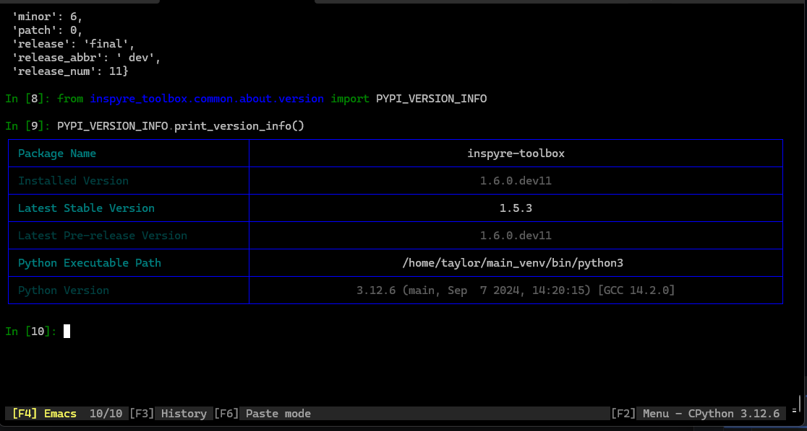

# VersionParser - Version Parsing Utility



## Overview

The `VersionParser` class is a powerful and flexible tool designed to parse, compare, and format version strings in a
structured and meaningful way. This utility simplifies version handling, enabling developers to manage version
information across projects efficiently.

Integrated as part of the **Inspyre Toolbox**, this module works seamlessly with other tools like `PyPiVersionInfo` to
provide a comprehensive solution for managing versioning of Python packages and applications.

## Key Features

- **Version Parsing**: Parses a version string into its major, minor, patch, and release components.
- **Release Types**: Maps various release types such as development, alpha, beta, and release candidate builds to
  human-readable descriptions.
- **Full Version String Formatting**: Provides a formatted, readable version string based on the parsed version
  components.
- **Rich Console Output**: Uses the `rich` library to display parsed version information in a styled table format.
- **Version Comparison**: Implements standard comparison operators (`==`, `<`, `>`, `<=`, `>=`) to compare different
  versions.
- **Arithmetic Operations**: Supports adding and subtracting versions or version components, making version management
  more intuitive.

This module is an essential part of the **Inspyre Toolbox**, enhancing your version management capabilities in a
user-friendly manner.

## How It Fits Into Inspyre Toolbox

The `VersionParser` module is designed to help manage version strings for packages, releases, or software projects,
making it a perfect companion for the `PyPiVersionInfo` class within the **Inspyre Toolbox**. It provides a simple
interface to break down version strings and compare them across different projects or packages.

This tool can also be used to handle internal software versioning for any application, allowing developers to quickly
determine compatibility, update needs, or release status of various components.

## Installation

To use the `VersionParser` module, ensure that you have the required dependencies installed:

```bash
pip install inspyre-toolbox rich
```

Make sure the **Inspyre Toolbox** is installed, as the `VersionParser` module is part of this broader package.

## Usage

### 1. Parsing a Version String

To parse a version string, create an instance of the `VersionParser` class and pass the version string as an argument:

```python
from inspyre_toolbox.ver_man.classes.version_parser import VersionParser

version = VersionParser("1.2.3-beta.1")
```

This will parse the version `1.2.3-beta.1` into its respective components: major, minor, patch, release type, and
release number.

### 2. Accessing Parsed Components

Once you have parsed a version string, you can access its individual components:

```python
print(version.major)  # Output: 1
print(version.minor)  # Output: 2
print(version.patch)  # Output: 3
print(version.release)  # Output: Beta Build
print(version.release_num)  # Output: 1
```

### 3. Full Version String

You can also obtain a formatted full version string using the `full_version_string` property:

```python
print(version.full_version_string)  # Output: v1.2.3 Beta Build 1
```

### 4. Printing Version Information

To display the parsed version information in a formatted table using `rich`, use the `print_version` method:

```python
version.print_version()
```

This will output a table in the console showing the major, minor, patch, release, and release number.

### 5. Version Comparison

The `VersionParser` class supports standard comparison operators for versions:

```python
version_1 = VersionParser("1.2.3-beta.1")
version_2 = VersionParser("1.2.3-final")

if version_1 < version_2:
    print("Version 1 is older than Version 2")
```

### 6. Arithmetic Operations on Versions

You can add or subtract versions or version components using standard arithmetic operators:

```python
version_1 = VersionParser("1.2.3")
new_version = version_1 + 1  # Increments the patch version
print(new_version)  # Output: v1.2.4

version_2 = VersionParser("1.2.3")
reduced_version = version_2 - 1  # Decrements the patch version
print(reduced_version)  # Output: v1.2.2
```

### 7. Custom Release Types

The `VersionParser` allows you to define and manage custom release types through the `RELEASE_MAP`:

```python
RELEASE_MAP = {
    'dev': 'Development Build',
    'alpha': 'Alpha Build',
    'beta': 'Beta Build',
    'rc': 'Release Candidate Build',
    'final': 'Final Release Build'
}

# Accessing release type description
release_type = version.get_release('beta')  # Output: Beta Build
```

## Example

Here’s a full example showing how to use the `VersionParser` class:

```python
from inspyre_toolbox.ver_man.classes.version_parser import VersionParser

# Parse a version string
version = VersionParser("1.0.0-alpha.2")

# Print parsed version components
print(f"Major: {version.major}")
print(f"Minor: {version.minor}")
print(f"Patch: {version.patch}")
print(f"Release: {version.release}")
print(f"Release Number: {version.release_num}")

# Display the full version string
print(f"Full Version: {version.full_version_string}")

# Compare versions
version_1 = VersionParser("1.0.0")
version_2 = VersionParser("1.0.1")
if version_1 < version_2:
    print(f"{version_1} is older than {version_2}")

# Print the version information in a rich table format
version.print_version()
```

## Future Enhancements

As the **Inspyre Toolbox** grows, the `VersionParser` module will continue to evolve. Planned enhancements include:

- **Support for Semantic Versioning**: Enhanced parsing to support more complex versioning schemes such as
  `v2.0.0+build1234`.
- **Version Validation**: Additional features to validate versions against custom versioning schemes.
- **Enhanced Arithmetic Operations**: More flexibility in handling version addition/subtraction across different version
  components (e.g., major, minor).

## Contributing

If you would like to contribute to the `VersionParser` module or other tools in the **Inspyre Toolbox**, please refer to
the [Contribution Guidelines](https://github.com/Inspyre-Softworks/Inspyre-Toolbox/blob/main/CONTRIBUTING.md).

For feature requests, bug reports, or general discussions, please create an issue on
the [GitHub repository](https://github.com/Inspyre-Softworks/Inspyre-Toolbox/issues).

## License

This module, along with the entire **Inspyre Toolbox**, is licensed under the MIT License. Please refer to
the [LICENSE](https://github.com/Inspyre-Softworks/Inspyre-Toolbox/blob/main/LICENSE) file for more details.
